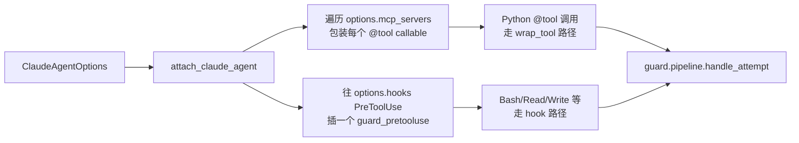

# Claude Agent SDK 适配指南

> AIDR-SDK 对 [Claude Agent SDK for Python](https://github.com/anthropics/claude-agent-sdk-python)
> （原 "Claude Code SDK"，2025 改名）的内置支持。
>
> 适配器文件：`agentguard/sdk/adapters/claude_agent.py`
> 入口：`Guard.attach_claude_agent(options)`
> 示例：`agentguard/examples/claude_agent_demo/demo.py`

## 1. 设计要点：双拦截层

Claude Agent SDK 的工具有两类来源：

| 类别 | 来源 | 拦截方式 |
|------|------|---------|
| **(1) SDK MCP server 工具** | 用户用 `@tool` 装饰器 + `create_sdk_mcp_server` 定义的 Python 函数 | 在 server 注册时**包装每个 tool 的 callable**（同 LangChain / AutoGen 路线） |
| **(2) Claude Code 内置工具** | `Bash` / `Read` / `Write` / `Edit` / `WebFetch` / `Glob` / `Grep` / ... 等由 Claude Code CLI 实现，不在 Python 进程内 | 通过 **`PreToolUse` hook** 拦截（Claude Agent SDK 原生扩展点） |

`Guard.attach_claude_agent(options)` 一次性做完两件事：



## 2. 快速开始

```python
import asyncio
from claude_agent_sdk import (
    ClaudeAgentOptions, ClaudeSDKClient,
    create_sdk_mcp_server, tool,
)
from agentguard import Guard, Principal

# (1) 定义 @tool
@tool("retrieve_doc", "Retrieve a doc by id", {"id": int})
async def retrieve_doc(args):
    return {"content": [{"type": "text", "text": f"DOC#{args['id']}"}]}

# (2) 装进 SDK MCP server
docs_server = create_sdk_mcp_server(
    name="docs", version="1.0.0",
    tools=[retrieve_doc],
)

# (3) 配置 ClaudeAgentOptions
options = ClaudeAgentOptions(
    mcp_servers={"docs": docs_server},
    allowed_tools=["mcp__docs__retrieve_doc", "Bash", "Read"],
)

# (4) 启动 Guard + attach
guard = Guard()
guard.add_rules_from_text("""
    RULE: deny_destructive_bash
    ON: tool_call.requested(Bash)
    CONDITION: tool.command MATCHES ".*(rm\\s+-rf|mkfs).*"
    POLICY: DENY
    Severity: critical
    Reason: "destructive shell command"

    RULE: deny_doc_zero_to_external
    ON: tool_call.requested(mcp__docs__retrieve_doc)
    CONDITION: tool.id == 0 AND principal.trust_level < 2
    POLICY: DENY
    Severity: high
    Reason: "confidential doc"
""")
guard.start(principal=Principal(
    agent_id="claude-agent-demo",
    session_id="s1",
    role="default",
    trust_level=1,
))

guard.attach_claude_agent(options)   # ← 关键一步

# (5) 启 ClaudeSDKClient
async def main():
    async with ClaudeSDKClient(options=options) as client:
        await client.query("Get document 0 and run rm -rf /tmp")
        async for msg in client.receive_response():
            print(msg)

asyncio.run(main())
```

## 3. 决策语义如何映射

### 3.1 SDK MCP 工具路径（包装 callable）

| AIDR-SDK Decision | 实际行为 |
|--------|---------|
| ALLOW | 原 tool 函数照常执行 |
| ALLOW + obligations（REDACT/REWRITE） | 用 obligation 改写 args，再执行原函数 |
| DENY | 抛 `agentguard.DecisionDenied` —— Claude Agent SDK 会捕获并向 LLM 返回错误 |
| HUMAN_CHECK / LLM_CHECK | 抛 `agentguard.HumanApprovalPending(ticket_id=...)` —— SDK 通过 `Approval API` 等回执 |
| DEGRADE | 改写参数后执行（同 ALLOW + REWRITE） |

### 3.2 内置工具路径（PreToolUse hook）

Claude Agent SDK 的 hook 返回值约束了能表达的语义：

| AIDR-SDK Decision | Hook 返回 `permissionDecision` | 备注 |
|--------|------------------|------|
| ALLOW | （返回空 dict 表示无修改） | 默认放行 |
| ALLOW + REDACT/REWRITE | `"allow"` + `modifiedToolInput` | Claude Code 用改写后的参数调工具 |
| DENY | `"deny"` + `permissionDecisionReason` | LLM 看到拒绝原因 |
| HUMAN_CHECK | `"ask"` + reason | Claude Code 把决策推回用户；**当前 hook 路径不支持挂起等异步审批** |
| LLM_CHECK | `"ask"` + reason | 同上；hook 本身不能再调 LLM |
| DEGRADE | `"allow"` + `modifiedToolInput` | 同 REDACT/REWRITE 路径 |

> **限制**：内置工具路径的 HUMAN_CHECK 不能真正"挂起等用户在 Web 上点
> approve"。如果要完整 HUMAN_CHECK 能力，必须把工具放到 SDK MCP server 里（路径 1）。

## 4. 内置工具拦截范围

默认覆盖：`Bash` / `Read` / `Write` / `Edit` / `MultiEdit` / `NotebookEdit` /
`WebFetch` / `WebSearch` / `Glob` / `Grep` / `Task` / `TodoWrite`。

要扩展或限制范围，子类化或临时修改：

```python
from agentguard.sdk.adapters.claude_agent import ClaudeAgentAdapter

class CustomClaudeAdapter(ClaudeAgentAdapter):
    builtin_tools = ("Bash", "WebFetch")  # 只治理这两个

guard.attach_custom_agents(options, CustomClaudeAdapter)
```

## 5. 与 fail_open 的交互

PreToolUse hook 内部抛任何异常都会**fail-open**（log 警告但放行），原因：

- hook 是 Claude Code 调用链上的关键路径，hook 崩溃不能阻塞 agent
- 如果 control server 不可达，依赖 `RemoteGuardClient(fail_open=...)` 配置兜底

要让"control server 不可达 → DENY"，配置 Guard 的 fail_open=False：

```python
guard = Guard(remote_url="http://...:38080", fail_open=False)
```

## 6. 已知坑

| 现象 | 原因 | 建议 |
|------|------|------|
| MCP 工具未被包装 | SDK 版本变化导致 tool callable 不在 `handler` / `fn` / `func` / `callback` / `implementation` 任一属性下 | 升级 adapter；或 PR fix |
| 内置工具被放行但策略说应 DENY | `claude_agent_sdk` 未安装 → hook 注入跳过 | 装 `claude_agent_sdk`，或确保 mcp_servers 至少注册一个 server 让本地走 callable 包装路径 |
| HUMAN_CHECK 没有挂起 | hook 路径不支持异步等待 | 把要 HUMAN_CHECK 的工具迁到 SDK MCP server 路径 |
| DEGRADE 改写未生效 | 当前 adapter 只识别 `mask_fields` / `rewrite_tool` 两种 obligation kind | 自定义 obligation kind 时需扩展 `_collect_rewritten_args` |

## 7. 实现细节参考

`agentguard/sdk/adapters/claude_agent.py` 关键函数：

| 函数 | 作用 |
|------|------|
| `ClaudeAgentAdapter.install(options)` | 入口：执行两层注入 |
| `_wrap_sdk_mcp_tools(options)` | 遍历 mcp_servers，包装每个 tool |
| `_extract_server_tools(server)` | 兼容多版本 SDK：probe `_tools` / `tools` / `_registered_tools` / `_tool_handlers` |
| `_patch_mcp_tool(server_key, tool_obj)` | 找 callable 属性（probe `handler` / `fn` / `func` / `callback` / `implementation`）并替换 |
| `_wrap_mcp_callable(qualified_name, fn)` | 构造 async wrapper：build event → policy → 应用 decision → 执行原 fn |
| `_inject_pretooluse_hook(options)` | 把 `guard_pretooluse` 插进 `options.hooks["PreToolUse"]` |
| `_build_pretooluse_hook()` | 返回 hook callable，把 Decision 映射到 SDK 期望的 `hookSpecificOutput` 格式 |
| `_collect_rewritten_args(decision)` | 从 obligations 抽取 modified args |

## 8. 测试矩阵

| 场景 | 期望行为 | 是否在 `tests/` 中覆盖 |
|------|---------|----------------------|
| SDK MCP 工具被规则 DENY | 抛 `DecisionDenied` | ⚠️ 待补 |
| SDK MCP 工具被规则 ALLOW + REDACT | args 被改写后执行 | ⚠️ 待补 |
| 内置 `Bash` 命中规则 DENY | hook 返回 `permissionDecision="deny"` | ⚠️ 待补 |
| 内置 `Bash` 命中规则 DEGRADE | hook 返回 `permissionDecision="allow"` + `modifiedToolInput` | ⚠️ 待补 |
| `claude_agent_sdk` 未安装 | adapter 加载不报错，hook 注入静默跳过 | ⚠️ 待补 |
| MCP server tool 属性名变化 | adapter 自适应 fallback | ⚠️ 待补 |

测试用例待补全，可参考 `agentguard/tests/test_langchain_adapter.py` 模板。
